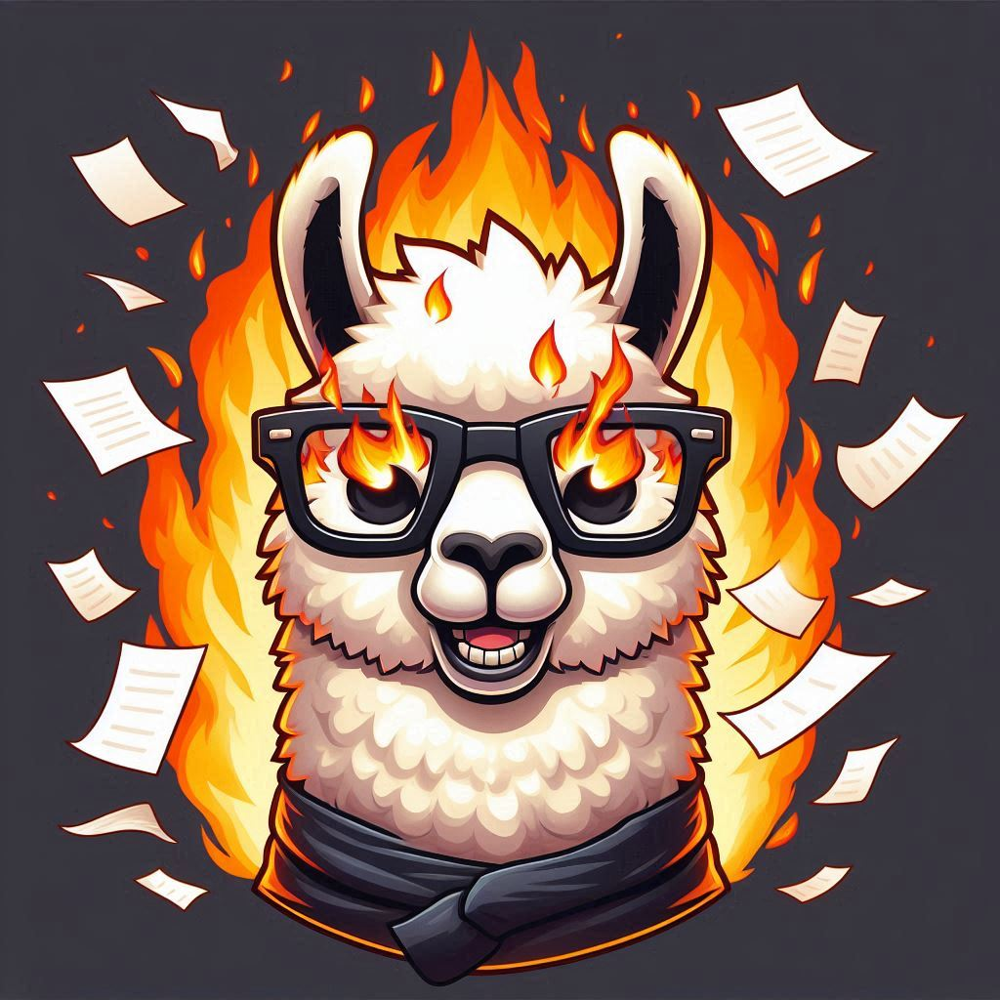

# Como realizar este tutorial

    

## 1. Si estás en Windows, instala WSL y Ubuntu

## 2. Instala CUDA si quieres usar la GPU
#### https://www.youtube.com/watch?v=JaHVsZa2jTc

## 3. Instala Ollama y el modelo con el que vayas a ejecutar

## 4. Crear el ambiente con python -m venv .venv y activalo con source .venv/bin/activate

## 5. Instala las librerías

## 5.5 Crea la carpeta indexes para guardar los indices y data que es donde pondrás los pdf para procesar

## 6. En la consola de linux ejecuta ollama con el modelo de preferencia, en este caso ollama run llama3.1:8b

## 7. Ejecuta el script de python

## Ejemplo para realizar el bot con Gradio:
#### https://medium.com/@imabhi1216/implementing-rag-using-langchain-and-ollama-93bdf4a9027c

## 8. Para crear un indice agregar el archivo pdf a la carpeta de data y luego ejecuta el script de crear indice

## 9. Para ejecutar gradio con ese script ejecuta el archivo main y escoge el indice al cual quieres preguntar

## 10. Al finalizar para apagar el servidor de ollama usa el comando /bye

## 11. Cierra también el servidor de gradio usando control + c

    

## Pasos siguientes
#### Agregar el script para hacer indices de multiples archivos al tiempo
#### Agregar script para la ejecución de orquestación de temas
#### Ampliar la clase repositories para trabajar con multiples métodos de spliting, y multiples bases vectoriales
#### Realizar finetuning con modelos sml
#### Realizar agente con rag graph Langchain